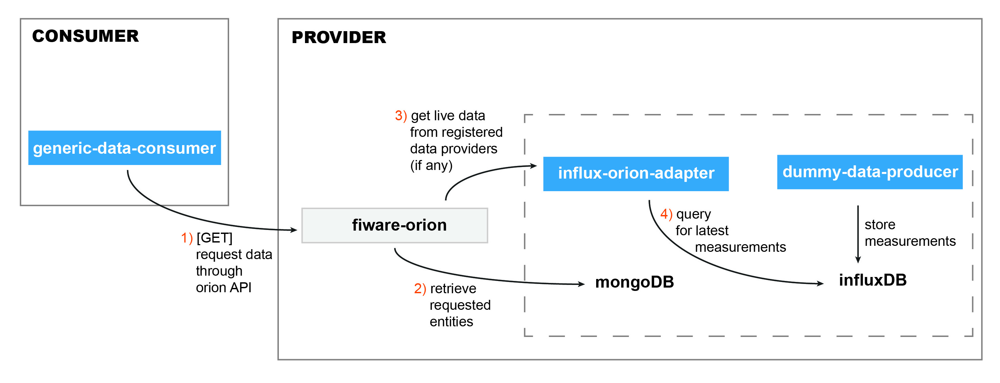
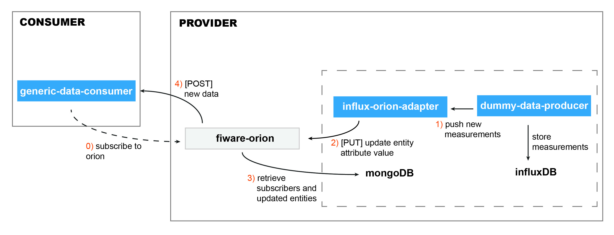

vnaskos Fiware Based IDS Connector
=====================

## Setup
* Start the docker containers (__InfluxDB, MongoDB, Orion__)
    * `docker-compose up`
* Run the configuration script
    * `./config.sh`

__(details and further instructions can be found on _orion-init.md_)__

**Note:** All requests to __Orion__ and __STH-Comet__ must contain the following headers
```
'FIWARE-Service: default'
'FIWARE-ServicePath: /'
```

## Architecture





## Dummy Data Producer

Create dummy data for the influx db

### Manual Run

In the __dummy-data-producer__ directory run `./gradlew bootRun`

By default the application runs on port 8080

### Endpoints

* `http://localhost:8080/temperature/random` Write a single _point_ in influxdb containing random data

* `http://localhost:8080/template` **[POST]** Write a custom _point_ in influxdb from a template on request's body. (Check temperature response for template structure)

## Influxdb to Orion Adapter (data provider)

* `http://localhost:8081/v1/temperature/list` List all influxdb entries

* `http://localhost:8081/v1/temperature/queryContext` Used by orion when the application is registered as a data provider

* `http://localhost:8081/temperature/sensor/{sensorId}/value/{newTemperature}` Update the temperature value

## Generic orion consumer

* `http://localhost:8082/v1/temperature/sensor/{sensorId}` Query directly the orion instance for sensor data

* `http://localhost:8082/v1/subscription/temperature/changed` **[POST]** Hook for orion field subscription _(it does not work with fields coming from data provider)_

* `http://localhost:8082/v1/subscription/temperature/debug` Check if actually orion notified the consumer for any data change
